# 🛡️ Awesome Sensitive Data Monitoring

  
  
  
  
  

> **Curated Ecosystem of SaaS Platforms & Open-Source Tools for Sensitive Data Monitoring**  
> *Focused on Data Security Posture Management (DSPM), PII/PHI Discovery, Automated Data Classification, Access Intelligence, Secret Detection, & Risk Governance.*

---

## 📑 Table of Contents

- [📊 Market Overview & Industry Landscape](#-market-overview--industry-landscape)
- [🛡️ SaaS / Hosted Commercial Platforms](#️-saas--hosted-commercial-platforms)
- [🔓 Open-Source GitHub Projects](#-open-source-github-projects)
- [🤝 How to Contribute](#-how-to-contribute)
- [⚠️ Disclaimer](#️-disclaimer)
- [📈 Star History](#-star-history)

---

## 📊 Market Overview & Industry Landscape

The global **Data Security Posture Management (DSPM) & Sensitive Data Monitoring** market is estimated at **$7.5 Billion to $15.2 Billion by 2030** (growing at a compound annual growth rate of **~30.4%**). 

The sector is currently **moderately-to-highly fragmented**, featuring enterprise cybersecurity giants (Microsoft, IBM, Palo Alto Networks) competing alongside fast-moving specialized DSPM unicorns (Cyera, BigID, Varonis, Securiti), with rapid innovation driving both active vendor acquisition/consolidation and community-driven open-source tooling.

---

## 🛡️ SaaS / Hosted Commercial Platforms

The following commercial platforms provide enterprise-wide, continuous data security posture management (DSPM), automated sensitivity labeling, access intelligence, and multi-cloud compliance governance. The table below is sorted by company size (Revenue / Valuation) in descending order.

| Product | Description | Company Size (Valuation / Revenue) 📈 | Starting Pricing 💰 | Free Tier / Trial Limit 🎁 |
| :--- | :--- | :--- | :--- | :--- |
| **[Microsoft Purview](https://www.microsoft.com/en-us/security/business/microsoft-purview)** 🌐 | Microsoft’s unified data governance & compliance suite covering discovery, labeling, DLP, and DSPM across M365 and Azure environments. | **Valuation: ~$3.1 Trillion** *(Annual Revenue: ~$245 Billion)* | Starting at $12/user/month (Purview Information Protection) or $0.40/capacity unit hour | 90-day Free Trial (up to 25 user licenses) / 30-day Data Map trial |
| **[IBM Guardium](https://www.ibm.com/products/guardium-data-protection)** 🏢 | Established data security platform focused on database activity monitoring, vulnerability assessment, and sensitive data protection. | **Valuation: ~$200 Billion** *(Annual Revenue: ~$62 Billion)* | Starting at ~$1,500 per managed server/year (or ~$100,000/year base enterprise tier) | 30-day Free Trial (Guardium Insights SaaS) / 90-day evaluation trial (Guardium Data Protection) |
| **[Dig Security](https://www.paloaltonetworks.com/prisma/cloud/dspm)** 🔒 | Real-time cloud data security posture management (DSPM) and DDR, now integrated into Palo Alto Networks Prisma Cloud. | **Valuation: ~$110 Billion** *(Annual Revenue: ~$8.0 Billion / Acquired for ~$400M)* | Starting at ~$18,000/year (~$1,500/month or $90/credit for Prisma Cloud) | 30-day Free Trial (up to 100 cloud workloads / accounts) |
| **[Normalyze](https://normalyze.io/)** ⚡ | Cloud DSPM platform targeting data posture, exposure detection, and risk prioritization (acquired by Proofpoint). | **Parent Valuation: ~$12.3 Billion** *(Annual Revenue: ~$1.5 Billion / Acquired for ~$200M)* | Starting at $995/month (Premium plan for up to 3 cloud accounts & 1 TB data) | Free forever plan available for 1 cloud account ($0 cost) |
| **[Varonis](https://www.varonis.com/)** 👁️ | Data security platform strong in access intelligence, permissions analytics, and monitoring of sensitive data exposure across hybrid environments. | **Valuation: ~$5.5 Billion** *(Annual Revenue: ~$540 Million)* | Starting at ~$50 – $95 per user/year (or ~$310/connector/year on AWS Marketplace) | 30-day Free Trial (Data Risk Assessment on full environment) |
| **[Cyera](https://www.cyera.com/)** 🚀 | Cloud-native DSPM platform discovering and securing sensitive data across cloud data stores with strong emphasis on data risk and AI readiness. | **Valuation: ~$3.0 Billion** *(ARR: ~$50M+ / Raised $300M+ Series C/D)* | Starting at $50,000/year (Standard Package up to 25 TB on AWS Marketplace) | 30-day Free Trial / Proof of Concept (up to 25 TB scanned) |
| **[BigID](https://bigid.com/)** 🔎 | Leading data discovery, classification, and privacy platform supporting DSPM, DSAR, and governance across structured and unstructured data. | **Valuation: ~$1.0 Billion** *(ARR: ~$100M+ / Unicorn status)* | Starting at ~$25,000/year (~$2,083/month) for entry-level deployments | 30-day Free Trial (Proof of Concept / live evaluation) |
| **[Securiti](https://securiti.ai/)** 🛡️ | Data command center combining privacy, security, and governance with sensitive data discovery and automation. | **Valuation: ~$1.0 Billion** *(ARR: ~$50M+ / Unicorn status)* | Starting at ~$50,000/year base entry (via AWS Marketplace platform contract) | 30-day Free Trial (Proof of Concept / guided environment trial) |
| **[Sentra](https://www.sentra.io/)** ☁️ | Cloud-native DSPM solution emphasizing continuous discovery, classification, and protection without moving data out of customer environments. | **Valuation: ~$300 Million** *(ARR: ~$15M+ / Raised $50M+)* | Starting at $50,000/year (Standard Plan 12-month contract on AWS Marketplace) | 30-day Free Trial / Proof of Concept (full feature evaluation) |
| **[Ground Labs](https://www.groundlabs.com/)** 🎯 | Specialized sensitive data discovery and scanning tools (Card Recon / Enterprise Recon) for locating regulated data across repositories. | **Valuation: ~$100 Million** *(ARR: ~$20M+)* | Starting at $1,250 per target/year (Card Recon Desktop & Server) | 7-day Free Trial (Card Recon Desktop scanner) |

---

## 🔓 Open-Source GitHub Projects

Open-source sensitive data projects focus on data classification frameworks, PII/PHI scanners, metadata catalogs with auto-tagging, secret detection engines, and redaction toolkits. The table below is sorted by **GitHub Star Count** in descending order.

| Repository | Description | Category 🏷️ | GitHub_Stars ⭐ |
| :--- | :--- | :--- | :--- |
| **[spaCy](https://github.com/explosion/spaCy)** 🧠 | Industrial-strength Natural Language Processing (NLP) library used as the foundational engine for custom Named Entity Recognition (NER) and PII extraction pipelines. | NLP & PII Detection Engine |  |
| **[Gitleaks](https://github.com/gitleaks/gitleaks)** 🔑 | Fast, lightweight open-source scanner for detecting hardcoded secrets, API keys, passwords, and tokens in git repositories and CI/CD pipelines. | Secret Detection Scanner |  |
| **[TruffleHog](https://github.com/trufflesecurity/trufflehog)** 🐷 | High-performance open-source scanner that searches git repositories, cloud storage (S3), and filesystems for secret leaks with active credential verification. | Secret & Credential Scanner |  |
| **[OpenMetadata](https://github.com/open-metadata/OpenMetadata)** 📊 | All-in-one metadata platform with automated data classification workflows (powered by NLP/spaCy) for tagging PII and sensitive data assets across data stacks. | Metadata Catalog & Classification |  |
| **[DataHub](https://github.com/datahub-project/datahub)** 🗂️ | Extensible data catalog and metadata platform enabling automated PII classification, schema discovery, and data lineage tracing. | Metadata & Governance Catalog |  |
| **[Microsoft Presidio](https://github.com/microsoft/presidio)** 🛡️ | Context-aware PII analyzer and anonymization service providing customizable PII detection, redaction, and masking for text and structured data. | PII Detection & Anonymization |  |
| **[Amundsen](https://github.com/amundsen-io/amundsen)** 🧭 | Open-source data search and metadata engine originally created by Lyft, supporting automated data classification and sensitive field discovery. | Data Discovery & Catalog |  |
| **[Detect-Secrets](https://github.com/Yelp/detect-secrets)** 🔍 | Enterprise-friendly secret detection tool developed by Yelp for identifying credential leaks in codebases without high false-positive rates. | Secret Scanner & CI/CD Tool |  |
| **[Bearer](https://github.com/bearer/bearer)** 🕵️ | Static Application Security Testing (SAST) & data flow tool designed to discover PII data flows and sensitive data security risks in source code. | Data Flow & PII Code Scanner |  |
| **[Phileas / Philterd](https://github.com/philterd/phileas)** 🩺 | Open-source PII/PHI redaction engine designed to identify, monitor, and redact sensitive health and personal data from unstructured text streams. | PII/PHI Redaction Engine |  |
| **[MDCGS](https://github.com/HaoY-l/mdcgs)** 🏷️ | Open-source data classification and grading system for auto-identifying sensitive fields across multiple database management systems. | Data Grading & Classification |  |

---

## 🤝 How to Contribute

Contributions are highly welcome! Help keep this repository comprehensive and up-to-date:

1. 🍴 **Fork the repository**.
2. 📝 **Add or edit entries in `README.md`** following the established table structure.
3. ℹ️ **Provide clear details**: Include the product/repo name, official link, brief description, pricing/stars, and free tier limits.
4. 🚀 **Submit a Pull Request** with a descriptive summary of your additions.

---

## ⚠️ Disclaimer

- This list is **community-curated** for educational and research purposes — it is not exhaustive and does not constitute an endorsement.
- Sensitive data discovery and risk monitoring involve regulated information (PII, PHI, PCI-DSS). Incorrect classification or improper handling of findings can create legal and security risks.
- Open-source tools require careful configuration, rule tuning, and operational oversight to meet compliance frameworks (GDPR, HIPAA, CCPA, SOC 2).

---

## 📈 Star History

---

  <b>Maintained with ❤️ for Data Security Engineers, CISOs, Privacy Officers &amp; Platform Engineers.</b>

